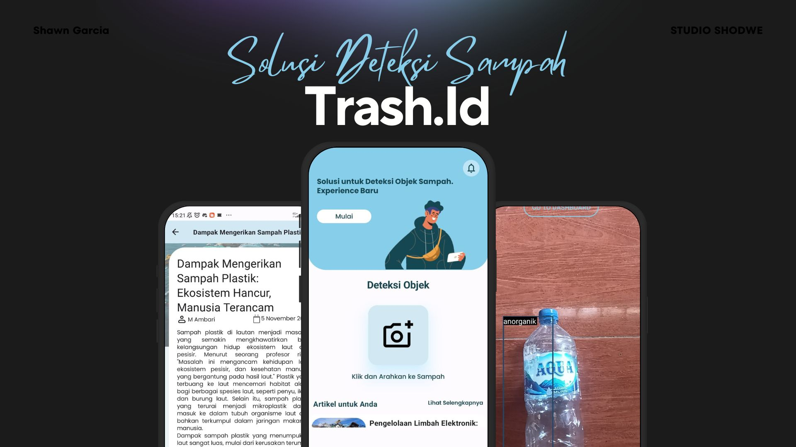
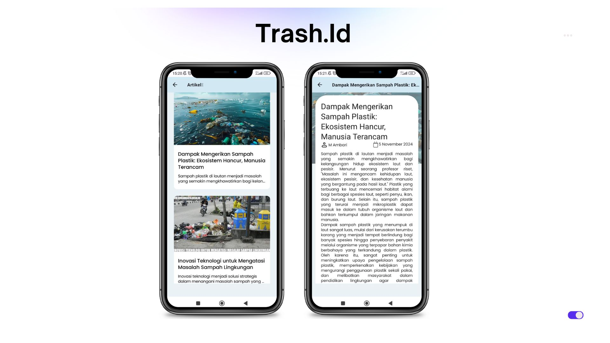
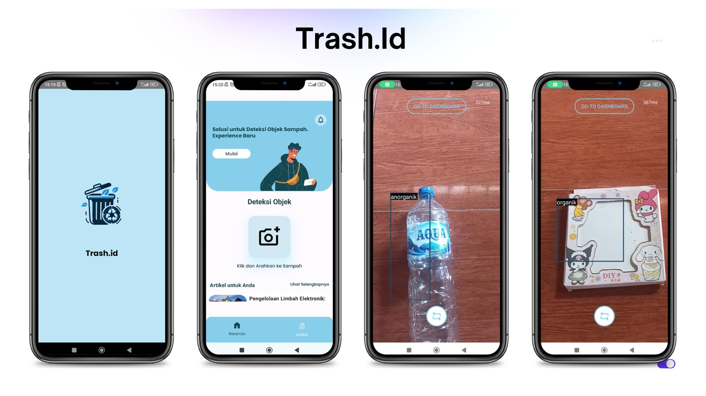

# TrashDetection
This project is about a real-time Trash detection application using the YOLO-n model trained on public datasets from Roboflow. The technologies used include Jetpack Compose, XML, and TensorFlow Lite. The model which has been converted to TFLite format, can be found in the `app -> src -> main -> assets -> model.tflite` folder.

## Preview 

     
     
     

## Features 
* Detect Trash: Detects trash in real time with back camera or front camera, categorized into organic and inorganic trash.
* List Articles Trash: Displays various informational articles related to Trash context.
* Article Details: Shows detailed articles with a parallax scrolling effect.

## Documentation 
* Train Model YOLO : 
* Live Demo App Trash.Id : <a href="https://youtube.com/shorts/Tj0UncCM-Ng" target="_blank">Trash Detection</a>
